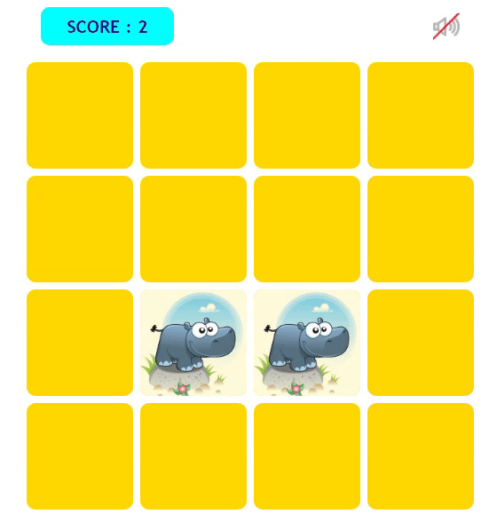

## How is it a game?

##### This is a jurchin game, It has 4 columns and 4 rows, What you have to do is to match the matching cards.For every correct move, you will hear a cheering sound and for every wrong move, You will hear a warning sound, This helps us to enjoy the game more.

##### Enter this [link](https://ali-asadpour.github.io/jurchin-game/) and enjoy playing😊

## How it Works?

    

## Scills:
-  

-  

-  
